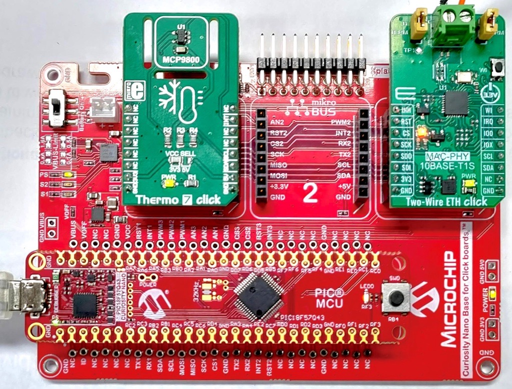
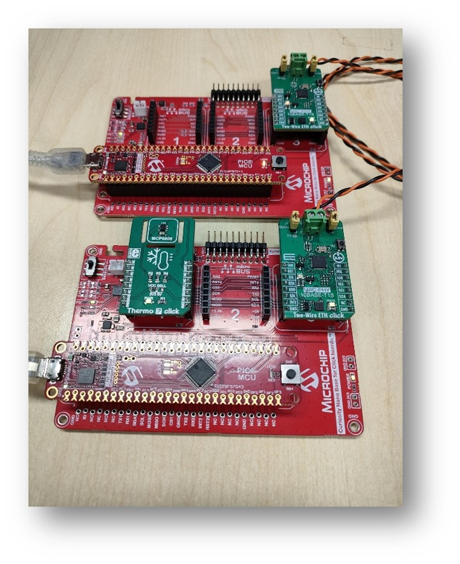
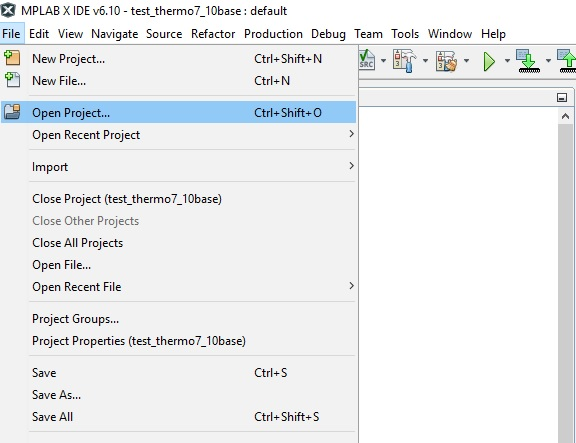
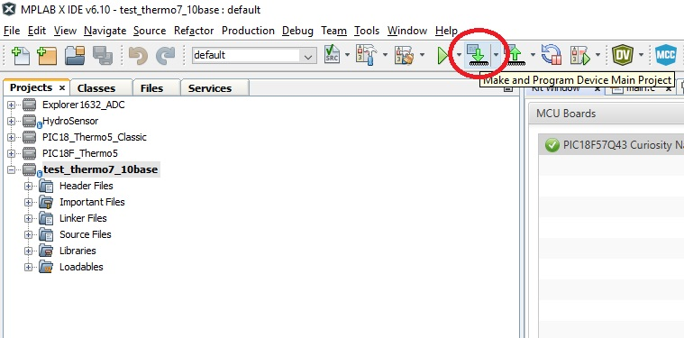
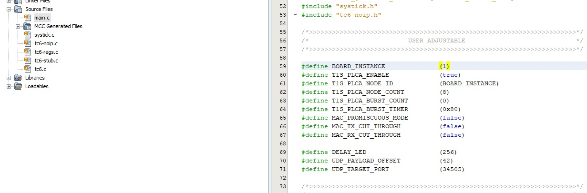
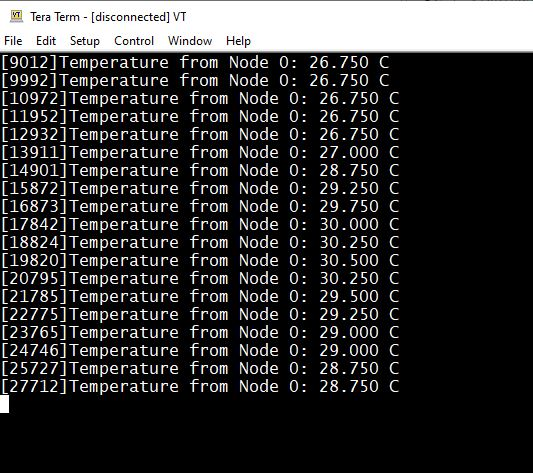



# Example on PIC18F57Q43 Curiosity Nano Evaluation Kit using the LAN865x 10BASE-T1S Ethernet MAC-PHY

This example shows how to configure the LAN865x to be used in a 10BASE-T1S Multi-Drop Ethernet network. The project shows basic sending and receive functionality of temperature sensor data, using predefined Ethernet frames.

## Building The Application
The parent folder for all the MPLAB X IDE projects for this application is given below:

**Application Path** : examples\noIP-PIC18-Curiosity-Nano

To build the application, refer to the table below and open the appropriate project file
in MPLABX IDE.
| Project Name              | Description                                               |
| ---                       | ---                                                       |
| PIC18.X | Main project holding the board support package and running the bare metal application.  |

## Documentation how this Application was built:
* [10baset1s_thermo7.pdf](10baset1s_thermo7.pdf)

## Hardware setup

* Hardware used
    * [2x PIC18F57Q43 Curiosity Nano Evaluation Kit](https://www.microchip.com/en-us/development-tool/DM164150)
    * [2x Curiosity Nano Base for Click boards™](https://www.microchip.com/en-us/development-tool/AC164162)
    * [2x Two-Wire ETH Click Boards LAN8651B](https://www.mikroe.com/two-wire-eth-click)
    * [at least 1x Thermo 7 Click Board](https://www.mikroe.com/thermo-7-click)
* Hardware setup
    * Connect the DEBUG USB port on the board to the computer using a micro USB cable
    * Connect the Two-Wire ETH Click Board interface card to another 10BASE-T1S node (e.g. a second instance of this setup), using a twisted single pair cable.

* Software Used
    * [MPLABX v6.10](https://www.microchip.com/en-us/tools-resources/develop/mplab-x-ide)
    * [Harmony 3](https://www.microchip.com/en-us/tools-resources/configure/mplab-harmony)
    * [TC6 Library](https://github.com/MicrochipTech/oa-tc6-lib)

## Project Setup in MPLAB-X:

In MPLAB X IDE, navigate to File > Open Project:
 

Connect one of the Curiosity boards to the PC and then click on Make and Program Device and wait until the board is programmed.

Disconnect the first board and then connect the second board to the PC.

Open the **main.c** file and change the board instance from 0 to 1:

Click on Make and Program Device and wait until the board is programmed.

## Running the Application

1. Open a Terminal application (e.g. Tera Term or Putty) on the computer
2. Connect to the Virtual COM port and configure the serial settings as follows:
    * Baud : 115200
    * Data : 8 Bits
    * Parity : None
    * Stop : 1 Bit
    * Flow Control : None
 
The board with no Thermo7 Click mounted to it should start outputting the temperature data to the Terminal:
 

The second board, with the Thermo7 Click mounted will output the following message: 

*"Temperature from Node 1 invalid. Is Thermo7 click missing?"*

If a second Thermo7 Click is available, it can be mounted to the second Curiosity Base Board so both Nodes will exchange temperature data between each other.
