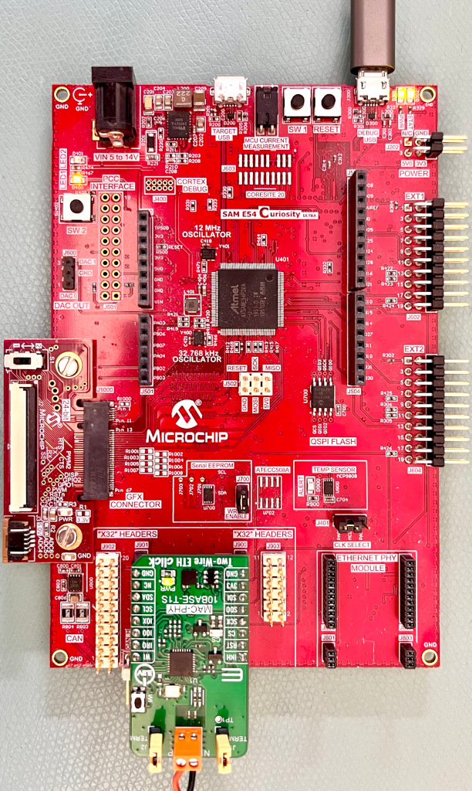

# RAW Ethernet example on SAM E54 Curiosity Ultra using the LAN865x 10BASE-T1S Ethernet MAC-PHY

This example shows how to configure the LAN865x to be used in a 10BASE-T1S Multi-Drop
Ethernet network in either PLCA and CSMA/CD mode. It also shows how to r/w registers
of the LAN865x during normal operation.
This example shows basic sending and receive functionality with predefined Ethernet frames.

## Building The Application
The parent folder for all the MPLAB X IDE projects for this application is given below:

**Application Path** : examples\noIP-SAM-E54-Curiosity

To build the application, refer to the table below and open the appropriate project file
in MPLABX IDE.

| Project Name              | Description                                               |
| ---                       | ---                                                       |
| firmware\demo.X | Main project holding the board support package and running the bare metal application. This project pulls in libtc6.X as library.  |
| libtc6.X  | Container to build a library out of the libtc6 source code from the root folder  |

## Hardware setup

* Hardware used
    * [SAM E54 Curiosity Ultra Development Board](https://www.microchip.com/en-us/development-tool/DM320210)
    * [SPI to 10BASE-T1S interface card](https://www.mikroe.com/two-wire-eth-click)
* Hardware setup
    * Connect the DEBUG USB port on the board to the computer using a micro USB cable
    * Connect the SPI to 10BASE-T1S interface card to another 10BASE-T1S node (e.g. a second instance of this setup)

## Settings for LAN865x

Configuration is done via #defines in the "main.c".

**MAC-PHY Settings**
The LAN865x MAC-PHY at the beginning of the "main.c":

    #define T1S_PLCA_ENABLE             (true)
    #define T1S_PLCA_NODE_ID            (0)
    #define T1S_PLCA_NODE_COUNT         (8)
    #define T1S_PLCA_BURST_COUNT        (0)
    #define T1S_PLCA_BURST_TIMER        (0x80)
    #define MAC_PROMISCUOUS_MODE        (false)
    #define MAC_TX_CUT_THROUGH          (true)
    #define MAC_RX_CUT_THROUGH          (false)

**PLCA Settings**

10BASE-T1S can be used in PLCA or CSMA/CD mode.
When using PLCA, the parameters for _Local Node ID_, _Node Count_,
_Max Burst Count_ and _Burst Timer_ must be configured.
These settings are stored in a subsection inside the MAC-PHY settings.

## Running the Application

1. Open a Terminal application (e.g. Tera term) on the computer
2. Connect to the Virtual COM port and configure the serial settings as follows:
    * Baud : 115200
    * Data : 8 Bits
    * Parity : None
    * Stop : 1 Bit
    * Flow Control : None
3. Build and Program the application using the MPLAB X IDE
    For optimum results, select "Release" Mode as build target, this requires fee-based XC32 compiler license.
